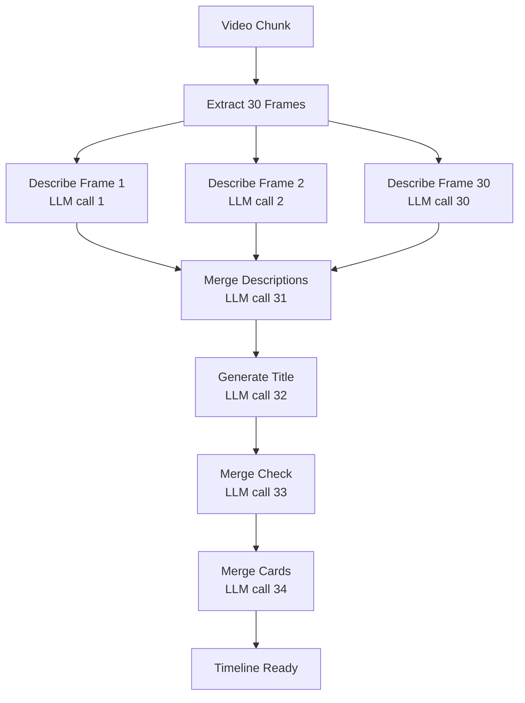

Local models keep all processing on your Mac, offering complete privacy at the cost of more processing time and battery usage.

## Supported Engines

Dayflow supports three local inference engines:

<CardGroup cols={3}>
  <Card title="Ollama" icon="server">
    Default port: `11434`
    
    Popular open-source models
  </Card>
  <Card title="LM Studio" icon="laptop">
    Default port: `1234`
    
    User-friendly GUI for model management
  </Card>
  <Card title="Custom" icon="code">
    Any OpenAI-compatible endpoint
    
    Bring your own server
  </Card>
</CardGroup>

## Installing Ollama

<Steps>
  <Step title="Download Ollama">
    Visit [https://ollama.com](https://ollama.com) and download the macOS installer
  </Step>
  <Step title="Install and start">
    Install the app and Ollama will automatically start running in the background
  </Step>
  <Step title="Pull a model">
    Open Terminal and run:
    ```bash
    ollama pull llama3.2-vision:11b
    ```
    Or choose another vision model from [https://ollama.com/library](https://ollama.com/library)
  </Step>
  <Step title="Verify it's running">
    Check that Ollama is accessible:
    ```bash
    curl http://localhost:11434/api/tags
    ```
  </Step>
</Steps>

## Installing LM Studio

<Steps>
  <Step title="Download LM Studio">
    Visit [https://lmstudio.ai](https://lmstudio.ai) and download the latest version
  </Step>
  <Step title="Launch and download a model">
    Open LM Studio, browse the model library, and download a vision-capable model
  </Step>
  <Step title="Start local server">
    Go to the **Local Server** tab and click **Start Server**. Default port is `1234`.
  </Step>
  <Step title="Verify it's running">
    LM Studio will show "Server Running" with the endpoint URL
  </Step>
</Steps>

<Note>
LM Studio documents full **offline** operation once models are downloaded. No internet connection required after setup.

Source: [https://lmstudio.ai/docs/app/offline](https://lmstudio.ai/docs/app/offline)
</Note>

## Configuring in Dayflow

<Steps>
  <Step title="Open Settings">
    Launch Dayflow and go to **Settings → AI Provider**
  </Step>
  <Step title="Select Local">
    Choose **Local** from the provider options
  </Step>
  <Step title="Choose engine">
    Select **Ollama**, **LM Studio**, or **Custom**
  </Step>
  <Step title="Set endpoint URL">
    - Ollama: `http://localhost:11434`
    - LM Studio: `http://localhost:1234`
    - Custom: Enter your server URL
  </Step>
  <Step title="Select model">
    Choose the model you want to use from the dropdown (Dayflow will fetch available models from the server)
  </Step>
</Steps>

## Model Selection

Dayflow reads available models from your local engine:

<CodeGroup>
```swift OllamaProvider.swift:14-19
private var savedModelId: String {
    if let m = UserDefaults.standard.string(forKey: "llmLocalModelId"), !m.isEmpty {
        return m
    }
    return LocalModelPreferences.defaultModelId(for: engine)
}
```
</CodeGroup>

The model ID is stored in `UserDefaults` and persisted across app launches.

### Recommended Models

For vision tasks (screenshot analysis), use models with multimodal capabilities:

- **Ollama**: `llama3.2-vision:11b`, `minicpm-v`, `llava`
- **LM Studio**: Look for models tagged with "vision" or "multimodal"

## Performance Considerations

### Processing Speed

Local models process each screenshot individually:



**Total: 33+ LLM calls per 15-minute batch**

<Warning>
Local processing is **significantly slower** than cloud options. A 15-minute batch may take 5-10 minutes to process depending on your hardware.
</Warning>

### GPU Acceleration on Apple Silicon

Both Ollama and LM Studio leverage **Metal** (Apple's GPU framework) for acceleration:

<CodeGroup>
```swift OllamaProvider.swift:201-246
private func getSimpleFrameDescription(_ frame: FrameData, batchId: Int64?) async -> String? {
    let prompt = """
    Describe what you see on this computer screen in 1-2 sentences.
    Focus on: what application/site is open, what the user is doing, and any relevant details visible.
    """
    
    // Build message with image
    let content: [MessageContent] = [
        MessageContent(type: "text", text: prompt, image_url: nil),
        MessageContent(type: "image_url", text: nil, image_url: MessageContent.ImageURL(url: "data:image/jpeg;base64,\(base64String)"))
    ]
    
    let request = ChatRequest(
        model: savedModelId,
        messages: [ChatMessage(role: "user", content: content)]
    )
    
    let response = try await callChatAPI(request, operation: "describe_frame", batchId: batchId, maxRetries: 1)
    return response.choices.first?.message.content
}
```
</CodeGroup>

Metal acceleration is automatic - no configuration needed. Verify GPU usage with Activity Monitor while processing.

### Battery and Power Trade-offs

Local inference is GPU-intensive:

- **Battery drain**: Expect 20-40% higher battery consumption during processing
- **Heat**: MacBook may run warmer under sustained inference load
- **Best practice**: Keep your Mac plugged in during processing
- **Processing schedule**: Consider processing batches only when charging

<Note>
Ollama GPU acceleration documentation: [https://github.com/ollama/ollama/blob/main/docs/gpu.md](https://github.com/ollama/ollama/blob/main/docs/gpu.md)
</Note>

## Privacy Benefits

All data stays on your Mac:

1. **Screenshot capture**: Stored locally in `~/Library/Application Support/Dayflow/recordings/`
2. **Model inference**: Runs entirely on-device via localhost
3. **Timeline data**: Saved in local SQLite database
4. **No internet required**: After initial model download, works completely offline

## Custom Endpoints

The **Custom** engine option allows any OpenAI-compatible API:

<CodeGroup>
```swift LocalEngine.swift:1-26
enum LocalEngine: String, CaseIterable, Identifiable, Codable {
    case ollama
    case lmstudio
    case custom

    var displayName: String {
        switch self {
        case .ollama: return "Ollama"
        case .lmstudio: return "LM Studio"
        case .custom: return "Custom"
        }
    }

    var defaultBaseURL: String {
        switch self {
        case .ollama: return "http://localhost:11434"
        case .lmstudio: return "http://localhost:1234"
        case .custom: return "http://localhost:11434"
        }
    }
}
```
</CodeGroup>

Requirements for custom endpoints:
- Must support OpenAI-compatible `/chat/completions` endpoint
- Must support vision/multimodal input (base64 images)
- Must return responses in OpenAI format

### Optional API Key

For custom endpoints requiring authentication:

<CodeGroup>
```swift OllamaProvider.swift:27-30
private var customAPIKey: String? {
    let trimmed = UserDefaults.standard.string(forKey: "llmLocalAPIKey")?.trimmingCharacters(in: .whitespacesAndNewlines) ?? ""
    return trimmed.isEmpty ? nil : trimmed
}
```
</CodeGroup>

Dayflow will send the API key in the `Authorization: Bearer <key>` header if configured.

## Troubleshooting

### Server Not Responding

If Dayflow can't connect to your local server:

1. **Verify the server is running**:
   ```bash
   # For Ollama
   curl http://localhost:11434/api/tags
   
   # For LM Studio
   curl http://localhost:1234/v1/models
   ```

2. **Check port conflicts**: Ensure nothing else is using the port
3. **Firewall**: Verify macOS firewall isn't blocking localhost connections

### Model Not Found

If the model isn't listed in Dayflow:

1. Ensure the model is fully downloaded
2. Restart the local inference server
3. Refresh the model list in Dayflow settings

### Slow Processing

If processing is taking too long:

1. **Use a smaller model**: Try a quantized or smaller parameter version
2. **Reduce screenshot frequency**: Fewer frames = fewer LLM calls
3. **Batch processing**: Let multiple batches accumulate before processing
4. **Check GPU usage**: Verify Metal acceleration is active in Activity Monitor

### Quality Issues

If timeline quality is poor:

1. **Try a larger/better model**: Larger vision models produce better descriptions
2. **Experiment with prompts**: Fork Dayflow and customize the prompt templates in `OllamaProvider.swift`
3. **Consider switching providers**: Gemini or ChatGPT/Claude may provide better results for your use case
