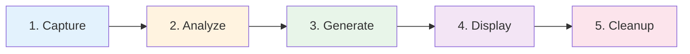
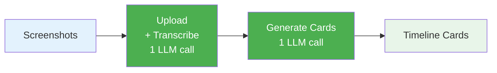
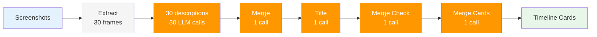
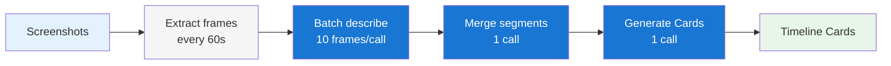

# AI Processing Pipeline

Dayflow's AI pipeline transforms screenshots into meaningful timeline cards through a multi-stage process. The exact implementation varies by AI provider to optimize for quality, cost, and latency.

## Pipeline Overview

The processing pipeline consists of five stages:



### 1. Capture Stage

**Responsibility**: Record screen activity as lightweight screenshots

**Implementation**: [ScreenRecorder.swift:304](source://Dayflow/Core/Recording/ScreenRecorder.swift:304)

**Process**:
1. Timer fires every 10 seconds (configurable via `ScreenshotConfig.interval`)
2. Captures active display using ScreenCaptureKit
3. Scales to ~1080p with aspect ratio preservation
4. Compresses as JPEG (quality: 0.85)
5. Saves to file system (~50-200KB per screenshot)
6. Persists metadata to `screenshots` table

**Key Features**:
- No recording indicator (uses screenshot API, not video stream)
- Automatic pause on sleep/lock/screensaver
- Multi-display support with active display tracking
- Even width/height for video encoding compatibility

**Storage Location**: `~/Library/Application Support/Dayflow/recordings/*.jpg`

### 2. Analyze Stage

**Responsibility**: Group screenshots into batches and send to AI for transcription

**Implementation**: [AnalysisManager.swift:326](source://Dayflow/Core/Analysis/AnalysisManager.swift:326)

**Batching Logic**:

```swift
// Screenshot batch creation (AnalysisManager.swift:476)
func createScreenshotBatches(from screenshots: [Screenshot]) {
    let maxGap: TimeInterval = config.maxGap         // 5 minutes
    let maxBatchDuration: TimeInterval = config.targetDuration  // 15-30 min
    
    // Break batch if:
    // 1. Gap between screenshots > 5 minutes
    // 2. Batch duration exceeds target duration
    // 3. Minimum batch duration: 5 minutes
}
```

**Batching Strategy**:
- **Check Interval**: Every 60 seconds
- **Max Gap**: 5 minutes (breaks batch if gap exceeds this)
- **Target Duration**: 15-30 minutes per batch
- **Minimum Duration**: 5 minutes (skips shorter batches)
- **Lookback Window**: 24 hours (only processes recent data)

**Database Updates**:
1. Create `analysis_batches` record
2. Link screenshots via `batch_screenshots` junction table
3. Mark batch status as `pending`
4. Queue for LLM processing

### 3. Generate Stage

**Responsibility**: Transform screenshots → observations → timeline cards

**Implementation**: [LLMService.swift:507](source://Dayflow/Core/AI/LLMService.swift:507)

**Two-Stage Processing**:

#### Stage 3a: Transcription (Screenshots → Observations)

**Purpose**: Convert visual screenshots into text descriptions

**Code**: [LLMService.swift:582](source://Dayflow/Core/AI/LLMService.swift:582)

```swift
// Transcribe screenshots using provider
let transcribeResult = try await executeWithProviderBackup(
    operation: "transcribe",
    batchId: batchId,
    primaryContext: primaryContext,
    activeContext: activeContext,
    backupContext: backupContext
) { context in
    try await context.actions.transcribeScreenshots(screenshots, batchStartDate, batchId)
}
observations = transcribeResult.value.observations
```

**Output**: Array of `Observation` objects:
```swift
struct Observation {
    let id: Int64?
    let batchId: Int64
    let startTs: Int        // Unix timestamp
    let endTs: Int
    let observation: String // Text description of screenshot
    let metadata: String?
    let llmModel: String?
}
```

**Example Observation**:
> "User is editing code in Xcode, working on ScreenRecorder.swift file, implementing the captureScreenshot function."

#### Stage 3b: Card Generation (Observations → Timeline Cards)

**Purpose**: Synthesize observations into activity cards

**Code**: [LLMService.swift:680](source://Dayflow/Core/AI/LLMService.swift:680)

**Sliding Window Context**:

```swift
// Calculate card-generation lookback window (LLMService.swift:624)
let currentTime = Date(timeIntervalSince1970: TimeInterval(batchEndTs))
let windowStartTime = currentTime.addingTimeInterval(-batchingConfig.cardLookbackDuration)

// Fetch observations from the recent batching window
let recentObservations = StorageManager.shared.fetchObservationsByTimeRange(
    from: windowStartTime,
    to: currentTime
)

// Fetch existing timeline cards for context
let existingTimelineCards = StorageManager.shared.fetchTimelineCardsByTimeRange(
    from: windowStartTime,
    to: currentTime
)
```

**Why Sliding Window?**
- Maintains context continuity across batch boundaries
- Allows merging/splitting activities that span multiple batches
- Provides AI with broader temporal context

**Context Provided to AI**:
```swift
struct ActivityGenerationContext {
    let batchObservations: [Observation]        // Current batch
    let existingCards: [ActivityCardData]       // Previous cards in window
    let currentTime: Date                       // Batch end time
    let categories: [LLMCategoryDescriptor]     // User-defined categories
}
```

**Output**: Array of `ActivityCardData`:
```swift
struct ActivityCardData {
    let startTime: String          // "2:30 PM"
    let endTime: String            // "3:45 PM"
    let category: String           // "Development"
    let subcategory: String        // "Coding"
    let title: String              // "Implementing screen recorder"
    let summary: String            // Brief description
    let detailedSummary: String    // Comprehensive summary
    let distractions: [Distraction]?
    let appSites: AppSites?        // Apps and websites used
}
```

**Card Replacement Strategy**:

```swift
// Replace old cards with new ones in the time range (LLMService.swift:698)
let (insertedCardIds, deletedVideoPaths) = StorageManager.shared.replaceTimelineCardsInRange(
    from: windowStartTime,
    to: currentTime,
    with: cards,
    batchId: batchId
)
```

**Why Replace Instead of Insert?**
- Handles activity merging/splitting across batches
- Ensures timeline accuracy when context changes
- Atomic update prevents duplicate cards
- Old timelapse videos are cleaned up automatically

### 4. Display Stage

**Responsibility**: Render timeline cards in the UI

**Implementation**: SwiftUI views observe database changes

**Process**:
1. Timeline view fetches cards for selected day
2. Groups cards by category and time
3. Displays with smooth animations
4. Generates timelapses on-demand when user clicks card

**Timelapse Generation**: [VideoProcessingService.swift](source://Dayflow/Core/Recording/VideoProcessingService.swift)

```swift
// On-demand timelapse creation
func generateTimelapse(for card: TimelineCard) {
    1. Parse time range from card.startTimestamp/endTimestamp
    2. Fetch screenshots in range from database
    3. Create video from screenshots using AVFoundation
    4. Save to file system with card ID
    5. Update card.videoSummaryURL in database
}
```

### 5. Cleanup Stage

**Responsibility**: Manage storage within configured limits

**Implementation**: [StorageManager.swift](source://Dayflow/Core/Recording/StorageManager.swift)

**Automatic Cleanup**:
- Runs hourly via scheduled timer
- Configurable storage limits (1GB - 20GB, or unlimited)
- Deletes oldest screenshots first
- Preserves timeline cards and observations
- Also deletes associated timelapse videos

**Manual Cleanup**: Settings → Storage → Delete recordings older than X days

## Provider-Specific Pipelines

The efficiency and quality of the pipeline varies significantly by AI provider:

### Gemini Pipeline: 2 LLM Calls

**Provider**: [GeminiDirectProvider.swift](source://Dayflow/Core/AI/GeminiDirectProvider.swift)

**Diagram**:


**Implementation Details**:

**Call 1: Upload + Transcribe**
```swift
// GeminiDirectProvider.swift
func transcribeScreenshots(
    _ screenshots: [Screenshot],
    batchStartTime: Date,
    batchId: Int64?
) async throws -> (observations: [Observation], log: LLMCall) {
    // 1. Create video from screenshots
    let videoURL = try await createVideoFromScreenshots(screenshots)
    
    // 2. Upload video to Gemini Files API
    let fileURI = try await uploadVideo(videoURL)
    
    // 3. Wait for video processing
    try await pollFileStatus(fileURI)
    
    // 4. Generate transcription with native video understanding
    let prompt = buildTranscriptionPrompt()
    let response = try await generateContent(
        model: current.model,
        fileURI: fileURI,
        prompt: prompt
    )
    
    // 5. Parse observations from response
    return parseObservations(response)
}
```

**Call 2: Generate Cards**
```swift
func generateActivityCards(
    observations: [Observation],
    context: ActivityGenerationContext,
    batchId: Int64?
) async throws -> (cards: [ActivityCardData], log: LLMCall) {
    let prompt = buildCardGenerationPrompt(
        observations: context.batchObservations,
        existingCards: context.existingCards,
        categories: context.categories
    )
    
    let response = try await generateContent(
        model: current.model,
        prompt: prompt
    )
    
    return parseActivityCards(response)
}
```

**Advantages**:
- ✅ **Most efficient**: Only 2 LLM calls per batch
- ✅ **Native video understanding**: Leverages Gemini's vision capabilities
- ✅ **Fast**: Typical batch processing: 30-60 seconds
- ✅ **Cost-effective**: Minimal API calls

**Fallback Strategy**:

```swift
// Automatic model fallback on capacity errors
models: [
    .gemini_2_0_flash_exp,     // Try first
    .gemini_1_5_flash          // Fallback on 429/503
]

// Automatic Gemma 2 fallback on persistent errors
if error.isCapacityError && hasGemmaBackup {
    fallbackState.preferGemma = true
    return try await gemmaProvider.transcribeScreenshots(...)
}
```

### Local Pipeline: 33+ LLM Calls

**Provider**: [OllamaProvider.swift](source://Dayflow/Core/AI/OllamaProvider.swift)

**Diagram**:


**Implementation Strategy**:

**Step 1: Extract Frames**
```swift
// Extract 30 frames evenly distributed across video
let frames = extractFrames(from: videoURL, count: 30)
```

**Step 2: Describe Each Frame (30 Calls)**
```swift
for (index, frame) in frames.enumerated() {
    let description = try await llm.describeImage(
        image: frame,
        prompt: "Describe what the user is doing in this screenshot."
    )
    observations.append(description)
}
```

**Step 3: Merge Observations (1 Call)**
```swift
let prompt = """
Merge these 30 observations into coherent activity segments:
\(observations.joined(separator: "\n"))
"""
let mergedSegments = try await llm.generate(prompt: prompt)
```

**Step 4: Generate Titles (1 Call per Segment)**
```swift
for segment in segments {
    let title = try await llm.generate(
        prompt: "Create a concise title for: \(segment)"
    )
}
```

**Step 5: Merge Check (1 Call)**
```swift
let shouldMerge = try await llm.generate(
    prompt: "Should these adjacent segments be merged? \(segment1) \(segment2)"
)
```

**Step 6: Final Merge (1 Call if needed)**

**Trade-offs**:
- ❌ **Inefficient**: 33+ LLM calls per batch
- ❌ **Slower**: Typical batch processing: 5-10 minutes
- ❌ **GPU-heavy**: Drains battery on unplugged MacBooks
- ✅ **Private**: All processing stays on-device
- ✅ **No API costs**: Free after model download
- ⚠️ **Quality varies**: Depends heavily on local model capabilities

**Recommended Models**:
- **LLaVA 7B/13B**: Good balance of speed and quality
- **BakLLaVA**: Optimized for screenshots
- **GPT4-Vision-like models**: Best quality but slower

### ChatGPT/Claude Pipeline: 4-6 LLM Calls

**Provider**: [ChatCLIProvider.swift](source://Dayflow/Core/AI/ChatCLIProvider.swift)

**Diagram**:


**Implementation Strategy**:

**Step 1: Extract Frames (Every 60s)**
```swift
// Extract frames at 60-second intervals
let frames = extractFrames(from: videoURL, interval: 60)
// For a 30-minute batch: ~30 frames
```

**Step 2: Batch Describe (3 Calls for 30 frames)**
```swift
// Process 10 frames per call
let batches = frames.chunked(into: 10)

for batch in batches {
    let descriptions = try await chatCLI.analyzeImages(
        images: batch,
        prompt: "Describe each screenshot and what the user is doing."
    )
}
```

**Step 3: Merge Segments (1 Call)**
```swift
let prompt = """
Merge these observations into coherent activities:
\(allDescriptions.joined(separator: "\n\n"))
"""
let segments = try await chatCLI.generate(prompt: prompt)
```

**Step 4: Generate Cards (1 Call)**
```swift
let cards = try await chatCLI.generateCards(
    observations: segments,
    existingCards: context.existingCards,
    categories: context.categories
)
```

**CLI Integration**:

```swift
// ChatCLIRunner.swift
func runChatCLI(
    tool: ChatCLITool,  // .codex or .claude
    prompt: String,
    images: [Data]
) async throws -> String {
    // 1. Save images to temp files
    let imagePaths = saveTemporaryImages(images)
    
    // 2. Build CLI command
    let command: String
    switch tool {
    case .codex:
        command = "codex \(imagePaths.joined(separator: " ")) --prompt \(prompt)"
    case .claude:
        command = "claude \(imagePaths.joined(separator: " ")) --prompt \(prompt)"
    }
    
    // 3. Execute CLI
    let process = Process()
    process.launchPath = "/usr/bin/env"
    process.arguments = ["bash", "-c", command]
    
    let output = try await process.run()
    
    // 4. Cleanup temp files
    cleanupTemporaryImages(imagePaths)
    
    return output
}
```

**Requirements**:
- **Codex CLI** installed and signed in (ChatGPT Plus/Pro)
- **Claude Code** installed and signed in (Claude Pro)
- Active internet connection
- Valid paid subscription

**Advantages**:
- ✅ **Best quality**: Frontier reasoning models (GPT-4V, Claude 3.5 Sonnet)
- ✅ **Efficient**: 4-6 calls vs. 33+ for local
- ✅ **Faster than local**: 1-3 minutes per batch
- ✅ **Streaming support**: Real-time updates in chat interface
- ❌ **Requires subscription**: $20/month minimum
- ❌ **Privacy**: Data processed by OpenAI/Anthropic

### Dayflow Backend Pipeline

**Provider**: [DayflowBackendProvider.swift](source://Dayflow/Core/AI/DayflowBackendProvider.swift)

**Purpose**: Cloud-based processing alternative for users without API keys

**Implementation**:
```swift
func transcribeScreenshots(...) async throws -> (observations: [Observation], log: LLMCall) {
    // Upload screenshots to Dayflow backend
    let uploadURL = try await uploadScreenshots(screenshots, to: endpoint)
    
    // Poll for processing completion
    let observations = try await pollForObservations(uploadURL)
    
    return observations
}
```

**Note**: Backend provider is currently in limited beta.

## Error Handling

### Provider Fallback

**Primary + Backup Provider System**: [LLMService.swift:308](source://Dayflow/Core/AI/LLMService.swift:308)

```swift
func executeWithProviderBackup<T>(
    operation: String,
    batchId: Int64?,
    primaryContext: TimelineProviderContext,
    activeContext: TimelineProviderContext,
    backupContext: TimelineProviderContext?,
    work: (TimelineProviderContext) async throws -> T
) async throws -> (value: T, activeContext: TimelineProviderContext, usedProviderBackup: Bool) {
    do {
        // Try primary provider
        let value = try await work(activeContext)
        return (value, activeContext, false)
    } catch {
        guard let backupContext else { throw error }
        
        // Log fallback attempt
        AnalyticsService.shared.capture("llm_timeline_fallback_attempted", ...)
        
        do {
            // Try backup provider
            let value = try await work(backupContext)
            AnalyticsService.shared.capture("llm_timeline_fallback_succeeded", ...)
            return (value, backupContext, true)
        } catch {
            AnalyticsService.shared.capture("llm_timeline_fallback_failed", ...)
            throw error
        }
    }
}
```

**User Configuration**: Settings → Providers → Backup Provider

### Error Cards

**When Processing Fails**: [LLMService.swift:822](source://Dayflow/Core/AI/LLMService.swift:822)

```swift
func createErrorCard(
    batchId: Int64,
    batchStartTime: Date,
    batchEndTime: Date,
    error: Error
) -> TimelineCardShell {
    return TimelineCardShell(
        startTimestamp: startTimeStr,
        endTimestamp: endTimeStr,
        category: "System",
        subcategory: "Error",
        title: "Processing failed",
        summary: "Failed to process \(duration) minutes... \(humanError) Your recording is safe and can be reprocessed.",
        detailedSummary: "Error details: \(error.localizedDescription)\n\nThis recording batch can be reprocessed by retrying from Settings."
    )
}
```

**User-Friendly Error Messages**: [LLMService.swift:851](source://Dayflow/Core/AI/LLMService.swift:851)

```swift
func getHumanReadableError(_ error: Error) -> String {
    // Maps technical errors to user-friendly messages
    // Examples:
    // - "Rate limited. Too many requests to Gemini. Please wait a few minutes."
    // - "Invalid API key. Please check your Gemini API key in Settings."
    // - "Google's AI services may be temporarily down. Check the status page."
}
```

## Performance Metrics

### Typical Processing Times (30-minute batch)

| Provider | LLM Calls | Processing Time | Cost (approx) |
|----------|-----------|-----------------|---------------|
| **Gemini 2.0 Flash** | 2 | 30-60 seconds | $0.05-0.10 |
| **Gemini 1.5 Flash** | 2 | 45-90 seconds | $0.03-0.08 |
| **ChatGPT (GPT-4V)** | 4-6 | 1-3 minutes | $0.50-1.50 |
| **Claude (3.5 Sonnet)** | 4-6 | 1-3 minutes | $0.40-1.20 |
| **Local (LLaVA 7B)** | 33+ | 5-10 minutes | Free |
| **Local (LLaVA 13B)** | 33+ | 8-15 minutes | Free |

### Storage Requirements (per day of recording)

**Screenshots** (10s interval, 16 hours/day):
- Count: ~5,760 screenshots
- Size: ~50-200KB each
- Total: ~300MB - 1.2GB/day

**Database**:
- Observations: ~1-2KB each
- Timeline Cards: ~2-5KB each
- Growth: ~5-10MB/day

**Timelapses** (generated on-demand):
- Size: ~5-20MB per card
- Cached until storage limit reached

## Debugging Tools

### LLM Call Logging

**View Recent Calls**: Settings → Debug → LLM Calls

**Database Table**: `llm_calls`

```sql
SELECT 
    created_at,
    batch_id,
    provider,
    operation,
    status,
    latency_ms,
    error_message
FROM llm_calls
ORDER BY created_at DESC
LIMIT 100;
```

### Observation Inspector

**View Transcriptions**: Settings → Debug → Observations

**Database Table**: `observations`

```sql
SELECT 
    batch_id,
    start_ts,
    end_ts,
    observation
FROM observations
WHERE batch_id = ?
ORDER BY start_ts;
```

### Batch Status

**View All Batches**: Settings → Debug → Analysis Batches

**Database Table**: `analysis_batches`

```sql
SELECT 
    id,
    status,
    batch_start_ts,
    batch_end_ts,
    reason
FROM analysis_batches
ORDER BY batch_start_ts DESC;
```

**Status Values**:
- `pending`: Waiting for processing
- `processing`: Currently being analyzed
- `analyzed`: Successfully completed
- `failed`: Processing error (see `reason`)
- `skipped_short`: Batch too short (less than 5 min)
- `failed_empty`: No screenshots in batch

## Next Steps

- [Architecture Overview](/development/overview) - System design
- [Project Structure](/development/project-structure) - Codebase organization
- [Contributing Guide](/contributing) - How to contribute