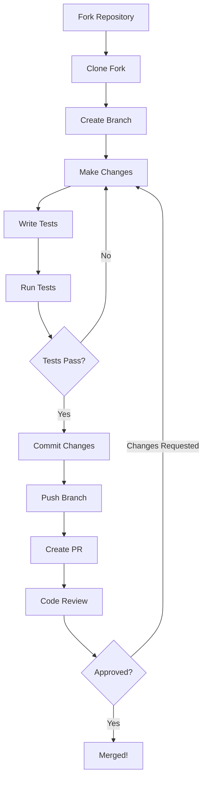

Thank you for your interest in contributing to Dayflow! This guide will help you get started.

## How to Contribute

Dayflow is an open-source project and welcomes contributions from the community.

### Before You Start

<Steps>
  <Step title="Check existing issues">
    Browse [GitHub Issues](https://github.com/JerryZLiu/Dayflow/issues) to see if your idea or bug has already been reported.
  </Step>

  <Step title="Open an issue for large changes">
    For significant features or architectural changes, please open an issue first to discuss scope and approach.
    
    <Info>
    This helps avoid duplicate work and ensures your contribution aligns with the project's direction.
    </Info>
  </Step>

  <Step title="Small fixes are always welcome">
    For bug fixes, typos, or minor improvements, feel free to submit a pull request directly.
  </Step>
</Steps>

### Types of Contributions

We welcome all types of contributions:

- **Bug fixes** - Fix issues reported in GitHub Issues
- **Features** - Add new functionality (discuss in an issue first)
- **Documentation** - Improve README, code comments, or guides
- **Testing** - Add unit tests or UI tests
- **Performance** - Optimize battery usage, memory, or processing speed
- **Refactoring** - Improve code quality and maintainability

## Code Style and Conventions

Dayflow follows standard Swift and SwiftUI conventions.

### Swift Style Guide

- **Indentation**: Use 2 spaces (not tabs)
- **Line length**: Aim for 100 characters, but readability takes precedence
- **Naming**:
  - Types: `PascalCase` (e.g., `TimelineCard`, `CaptureManager`)
  - Variables/functions: `camelCase` (e.g., `startRecording()`, `apiKey`)
  - Constants: `camelCase` (e.g., `maxStorageSize`, `defaultInterval`)
- **Access control**: Use the most restrictive access level appropriate
  - Prefer `private` over `fileprivate` when possible
  - Use `internal` (default) for app-internal APIs
  - Only use `public` for framework boundaries

### SwiftUI Best Practices

- **View composition**: Break down complex views into smaller, reusable components
- **State management**: Use `@State`, `@Binding`, `@ObservedObject`, and `@EnvironmentObject` appropriately
- **Preview providers**: Include SwiftUI previews for all custom views
- **Modifiers**: Chain view modifiers logically (layout → styling → behavior)

### Code Organization

```
Dayflow/
├─ Models/              # Data models and business logic
├─ Views/               # SwiftUI views and components
├─ ViewModels/          # View models and state management
├─ Services/            # Services (capture, AI, storage)
├─ Utilities/           # Helper functions and extensions
└─ Resources/           # Assets, entitlements, Info.plist
```

<Tip>
Group related files using Xcode's folder structure to keep the project organized.
</Tip>

### Comments and Documentation

- **Public APIs**: Use doc comments for public functions and types
  ```swift
  /// Starts the screen recording process.
  /// - Parameter interval: Capture interval in seconds
  /// - Returns: `true` if recording started successfully
  func startRecording(interval: TimeInterval) -> Bool {
    // Implementation
  }
  ```
- **Complex logic**: Add inline comments explaining "why", not "what"
- **TODOs**: Use `// TODO:` for future improvements
- **FIXMEs**: Use `// FIXME:` for known issues that need attention

## Testing Requirements

All contributions should include appropriate tests.

### Unit Tests

Located in `DayflowTests/`, unit tests verify individual components and logic.

**Example:**
```swift
import XCTest
@testable import Dayflow

class TimeParsingTests: XCTestCase {
    func testTimeInterval() {
        let interval = TimeInterval.from(minutes: 5)
        XCTAssertEqual(interval, 300)
    }
}
```

### UI Tests

Located in `DayflowUITests/`, UI tests verify user interface behavior.

**When to add tests:**
- **Always**: New functionality, bug fixes, refactored code
- **Encouraged**: Edge cases, error handling, complex logic

**Running tests:**
```bash
# Run all tests
xcodebuild test -project Dayflow/Dayflow.xcodeproj -scheme Dayflow

# Run specific test
xcodebuild test -project Dayflow/Dayflow.xcodeproj -scheme Dayflow -only-testing:DayflowTests/TimeParsingTests
```

<Info>
See [Development Setup](/development/setup#running-tests) for more details on running tests.
</Info>

## Submitting Pull Requests

Follow these steps to submit a pull request:

<Steps>
  <Step title="Fork and clone">
    Fork the repository and clone your fork:
    
    ```bash
    git clone https://github.com/YOUR_USERNAME/Dayflow.git
    cd Dayflow
    ```
  </Step>

  <Step title="Create a branch">
    Create a feature branch from `main`:
    
    ```bash
    git checkout -b feature/your-feature-name
    ```
    
    **Branch naming conventions:**
    - Features: `feature/short-description`
    - Bug fixes: `fix/issue-description`
    - Documentation: `docs/what-changed`
  </Step>

  <Step title="Make your changes">
    Implement your changes following the code style guidelines.
    
    - Write clear, focused commits
    - Include tests for new functionality
    - Update documentation if needed
  </Step>

  <Step title="Test thoroughly">
    Before submitting:
    
    ```bash
    # Run all tests
    xcodebuild test -project Dayflow/Dayflow.xcodeproj -scheme Dayflow
    
    # Build and run the app
    # Verify your changes work as expected
    ```
  </Step>

  <Step title="Commit your changes">
    Write descriptive commit messages:
    
    ```bash
    git add .
    git commit -m "Add timeline card customization options"
    ```
    
    **Good commit messages:**
    - `Fix crash when opening timeline with no data`
    - `Add Ollama model selection in settings`
    - `Improve battery efficiency of capture loop`
    
    **Avoid vague messages:**
    - ❌ `Fixed stuff`
    - ❌ `Update code`
    - ❌ `WIP`
  </Step>

  <Step title="Push and create PR">
    Push your branch and create a pull request:
    
    ```bash
    git push origin feature/your-feature-name
    ```
    
    Then visit GitHub and click **"Create Pull Request"**.
  </Step>

  <Step title="Describe your changes">
    In the PR description:
    
    - Explain **what** changed and **why**
    - Reference related issues (e.g., "Fixes #123")
    - Include screenshots for UI changes
    - Note any breaking changes or migration requirements
    
    **Example:**
    ```markdown
    ## Summary
    Adds support for custom capture intervals in the settings UI.
    
    ## Changes
    - Added slider component to settings view
    - Updated CaptureManager to accept custom intervals
    - Added unit tests for interval validation
    
    ## Testing
    - Tested with intervals from 1-60 seconds
    - Verified persistence across app restarts
    
    Fixes #42
    ```
  </Step>
</Steps>

### PR Review Process

1. **Automated checks** - Tests must pass before review
2. **Code review** - Maintainers will review your code and provide feedback
3. **Revisions** - Address any requested changes
4. **Merge** - Once approved, your PR will be merged

<Tip>
Be responsive to feedback and willing to iterate. Reviews help maintain code quality and are a learning opportunity for everyone.
</Tip>

## Development Workflow

Recommended workflow for contributors:



## License

By contributing to Dayflow, you agree that your contributions will be licensed under the MIT License.

### MIT License Summary

Dayflow is licensed under the MIT License. See the [LICENSE](https://github.com/JerryZLiu/Dayflow/blob/main/LICENSE) file for the full text.

**Key points:**
- ✅ Free to use, modify, and distribute
- ✅ Commercial use allowed
- ✅ Must include copyright notice and license text
- ⚠️ Provided "AS IS" without warranty of any kind

**Copyright**: Copyright (c) 2025 Jerry Liu

## Acknowledgements

Dayflow is built with the help of these excellent open-source projects:

- **[Sparkle](https://github.com/sparkle-project/Sparkle)** - Battle-tested macOS auto-update framework
- **[Google AI Gemini API](https://ai.google.dev/gemini-api/docs)** - Cloud-based AI analysis
- **[Ollama](https://ollama.com/)** - Local LLM inference
- **[LM Studio](https://lmstudio.ai/)** - Local model support with offline operation
- **[OpenAI Codex CLI](https://github.com/openai/codex)** - ChatGPT CLI integration
- **[Claude Code](https://docs.anthropic.com/en/docs/claude-code)** - Claude CLI integration

## Questions?

If you have questions about contributing:

- Check the [README](https://github.com/JerryZLiu/Dayflow/blob/main/README.md)
- Review [existing issues](https://github.com/JerryZLiu/Dayflow/issues)
- Open a new issue for discussion

Thank you for contributing to Dayflow!
