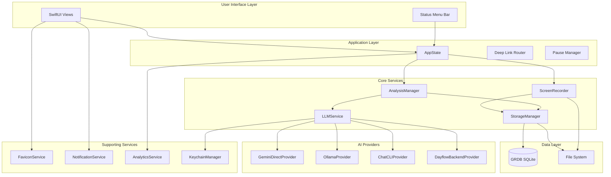
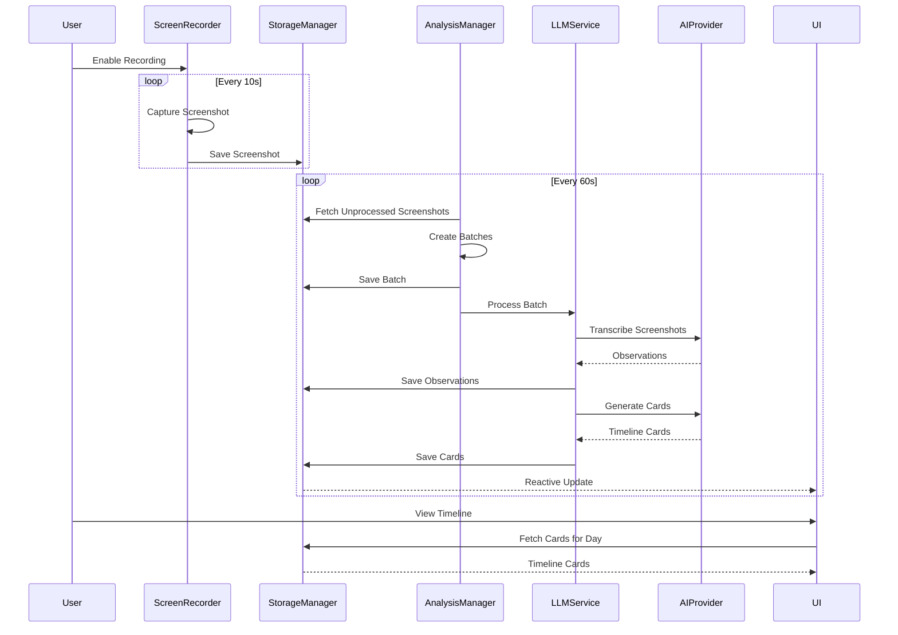

# Architecture Overview

Dayflow is a native macOS application built with SwiftUI that automatically tracks your screen activity and generates intelligent timelines using AI.

## High-Level Architecture

Dayflow follows a modular architecture with clear separation of concerns:



## System Architecture

Dayflow is a **native macOS application** built with:

- **SwiftUI** for the user interface
- **ScreenCaptureKit** for screen recording
- **GRDB** for local SQLite database
- **Combine** for reactive data flow
- **Swift Concurrency** (async/await) for asynchronous operations

### Key Design Principles

1. **Privacy-First**: All data stays on the user's Mac by default
2. **Provider-Agnostic**: Pluggable AI provider architecture (Gemini, Local, ChatGPT/Claude, Dayflow Backend)
3. **Efficient Capture**: Screenshot-based recording (10s intervals) instead of continuous video to minimize battery impact
4. **Batched Analysis**: Groups screenshots into logical batches (~15-30 min) for efficient AI processing
5. **Offline-Capable**: Core functionality works without internet (with local AI providers)

## Core Components

### ScreenRecorder

**Purpose**: Captures periodic screenshots of the active display

**Location**: `Dayflow/Core/Recording/ScreenRecorder.swift:82`

**Key Features**:
- Screenshot-based capture (configurable interval, default 10 seconds)
- No recording indicator (uses ScreenCaptureKit screenshot API)
- Automatic pause/resume on system sleep, lock, and screensaver
- Multi-display support with active display tracking
- ~1080p resolution with JPEG compression (quality: 0.85)

**State Machine**:
- `idle`: Not capturing
- `starting`: Initiating capture setup
- `capturing`: Active screenshot timer running
- `paused`: System event pause (sleep/lock), auto-resumes when ready

### StorageManager

**Purpose**: Manages local database and file system storage

**Location**: `Dayflow/Core/Recording/StorageManager.swift:432`

**Responsibilities**:
- SQLite database operations (GRDB)
- Screenshot file management
- Batch creation and tracking
- Timeline card persistence
- Observation (transcript) storage
- LLM call logging
- Automatic storage cleanup

**Database Schema**:
- `screenshots`: Captured screen images with timestamps
- `analysis_batches`: Groups of screenshots for AI processing
- `batch_screenshots`: Junction table linking batches to screenshots
- `observations`: AI-generated transcriptions of screenshots
- `timeline_cards`: Final activity summaries displayed to users
- `llm_calls`: Detailed logging of all LLM requests/responses
- `journal_entries`: Daily intentions and reflections (Beta)

### AnalysisManager

**Purpose**: Orchestrates the batching and analysis pipeline

**Location**: `Dayflow/Core/Analysis/AnalysisManager.swift:25`

**Key Responsibilities**:
- Monitors for unprocessed screenshots (runs every 60 seconds)
- Creates logical batches based on provider config (max duration, max gap)
- Queues batches for LLM processing
- Handles batch reprocessing for error recovery
- Performance tracking via Sentry transactions

**Batching Logic**:
```swift
// Default configuration
targetDuration: 15-30 minutes
maxGap: 5 minutes (breaks batch if gap exceeds this)
minimumDuration: 5 minutes (skips batches shorter than this)
```

### LLMService

**Purpose**: Manages AI provider interactions and processing pipeline

**Location**: `Dayflow/Core/AI/LLMService.swift:32`

**Key Features**:
- **Provider Abstraction**: Unified interface for multiple AI providers
- **Fallback System**: Automatic fallback to backup provider on errors
- **Two-Stage Processing**:
  1. **Transcription**: Screenshots → Observations (text descriptions)
  2. **Card Generation**: Observations → Timeline Cards (activity summaries)
- **Sliding Window**: Uses observations from previous batches for context continuity
- **Error Handling**: Creates error cards for failed batches, user-friendly error messages

**Supported Providers**:
- **Gemini**: 2 LLM calls per batch (most efficient)
- **Local (Ollama)**: 33+ LLM calls per batch (frame-by-frame analysis)
- **ChatGPT/Claude**: 4-6 LLM calls per batch (batch frame processing)
- **Dayflow Backend**: Cloud processing alternative

### AI Providers

#### GeminiDirectProvider
**Location**: `Dayflow/Core/AI/GeminiDirectProvider.swift:8`

Leverages Gemini's native video understanding:
- Direct video upload and analysis
- Model fallback (gemini-2.0-flash-exp → gemini-1.5-flash)
- Automatic Gemma 2 fallback on capacity errors

#### OllamaProvider
**Location**: `Dayflow/Core/AI/OllamaProvider.swift`

Local model support via Ollama:
- Frame-by-frame image analysis
- Multi-call segment merging
- No cloud dependency

#### ChatCLIProvider
**Location**: `Dayflow/Core/AI/ChatCLIProvider.swift`

CLI-based frontier models:
- Batch frame processing (10 frames per call)
- Codex CLI (ChatGPT) or Claude Code support
- Streaming and chat capabilities

## Tech Stack

### Frameworks & Libraries

- **SwiftUI**: Native UI framework
- **ScreenCaptureKit**: Screen recording API (macOS 13+)
- **GRDB**: SQLite database toolkit
- **Combine**: Reactive programming
- **Swift Concurrency**: async/await, actors, tasks
- **Sparkle**: Auto-update framework
- **PostHog**: Product analytics (privacy-conscious)
- **Sentry**: Error tracking and performance monitoring

### Development Tools

- **Xcode 15+**: IDE and build system
- **Swift 5.9+**: Programming language
- **Git**: Version control

### Storage

- **SQLite (GRDB)**: Local database with WAL mode
- **File System**: JPEG screenshots, video timelapses
- **UserDefaults**: App preferences and settings
- **Keychain**: Secure storage for API keys

### Networking

- **URLSession**: HTTP client for AI provider APIs
- **Foundation Networking**: Standard library networking

## Component Interactions

### Recording Flow

1. **AppState** manages recording state (`isRecording` published property)
2. **ScreenRecorder** observes state changes and starts/stops capture timer
3. Timer fires every 10s (configurable), captures screenshot via ScreenCaptureKit
4. Screenshot saved to file system as JPEG (~1080p, 85% quality)
5. **StorageManager** persists screenshot metadata to `screenshots` table

### Analysis Flow

1. **AnalysisManager** timer fires every 60s, checks for unprocessed screenshots
2. Groups screenshots into batches based on time gaps and duration
3. Persists batches to `analysis_batches` and `batch_screenshots` tables
4. Queues batch for **LLMService** processing
5. **LLMService** selects AI provider and executes two-stage pipeline:
   - Stage 1: Screenshots → Observations (transcription)
   - Stage 2: Observations → Timeline Cards (generation)
6. **StorageManager** saves observations and timeline cards
7. UI reactively updates to show new timeline cards

### Timeline Display Flow

1. SwiftUI views observe **StorageManager** data
2. Timeline cards fetched from database for selected day
3. Cards grouped by category and time
4. Timelapses generated on-demand when user clicks card
5. Video processing service creates timelapse from screenshot range

## Data Flow



## Performance Characteristics

- **App Size**: ~25MB
- **Memory Usage**: ~100MB RAM
- **CPU Usage**: Less than 1% idle, ~5-10% during screenshot capture
- **Battery Impact**: Minimal (screenshot-based vs continuous video)
- **Storage**: Configurable (1GB - 20GB, or unlimited)
- **Screenshot Size**: ~50-200KB per screenshot (JPEG)
- **Database Size**: Grows with usage, automatic cleanup

## Threading Model

- **Main Actor**: UI, AppState, MainWindowManager
- **Background Queues**:
  - `com.dayflow.recorder`: ScreenRecorder capture operations
  - `com.dayflow.geminianalysis.queue`: Analysis processing
  - `com.dayflow.storage.writes`: Database write operations
- **Async/Await**: LLM provider calls, file operations
- **Combine Publishers**: Reactive state propagation

## Next Steps

- [Project Structure](/development/project-structure) - Detailed codebase organization
- [AI Pipeline](/development/ai-pipeline) - Deep dive into AI processing stages